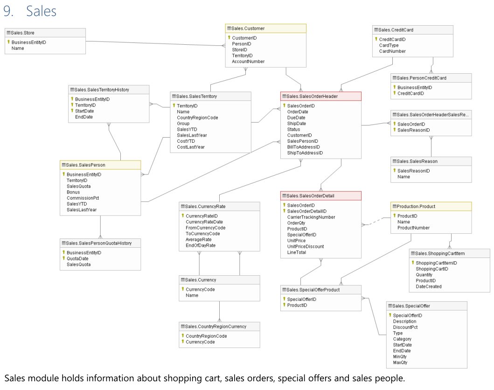

# EXERCISE SQL ADVENTUREWORKS DATABASE

### Overview of the data

The AdventureWorks databases are sample databases that were published by Microsoft to show how to design a SQL Server database. AdventureWorks database contain the data warehouse sample. The tables used in this exercise are belong to the Sales and Product categories (ER Diagram). The data is contained in  **AdventureWorks.db** SQLite database. For most information about the database visit the [repository](https://github.com/microsoft/sql-server-samples/tree/master/samples/databases/adventure-works) of author or original documentation [here](https://dataedo.com/download/AdventureWorks.pdf).

### AdventureWorks ER Diagram for  sales and product categories

### Detail the tables sales and product categories

**Product Tables:**
* **Product**: Product that the company sells
* **ProductReview**: Rating and review left by customers
* **ProductModelProductDescriptionCulture**: link file be products and her descriptions. Also, language and region of the product.
* **ProductDescription**: Description of each product, for a specific region
* **ProductCategory**: the broad categories that products fit into
* **ProductSubCategory**: the narrower subcategories that products fit into

**Sales Tables:**
* **SalesPerson**:  Salesperson information on their commission and performance
* **SalesOrderHeader**: Sale summarizing the sale
* **SalesOrderDetail**: Detailing each product that forms part of the sale
* **SalesTerritory**: Different territories where products are sold, including performance

**Region Tables:**
* **CountryRegionCurrency**: the currency used by each region
* **CurrencyRate**: the average and closing exchange rates for each currency compared to the USD

### NOTEBOOK

[Link notebook](https://github.com/lmlimasd/exercise_SQL_AdventureWorks_db/blob/main/workspace.ipynb)
